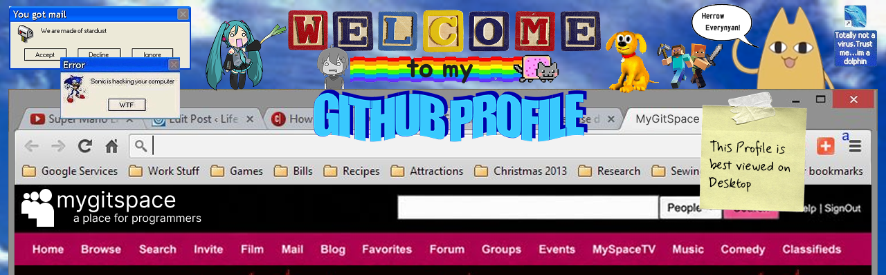
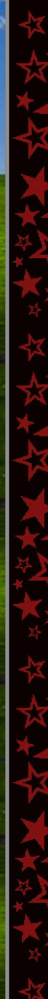
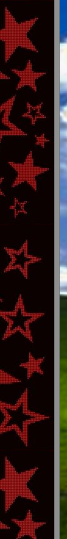
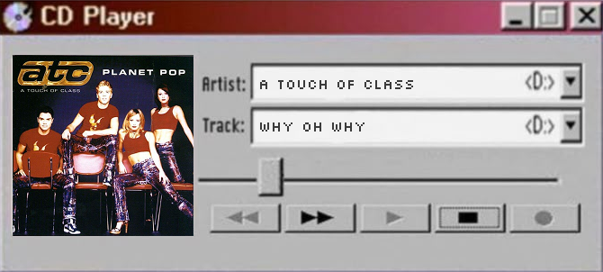
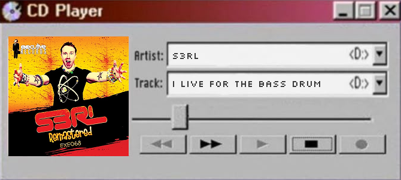
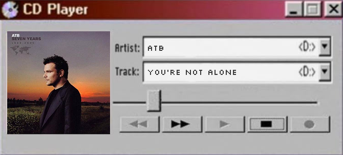
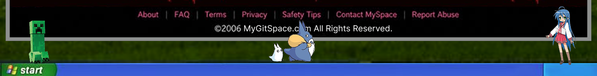

<!-- 
 CONTENT  -->

  <!-- TOP  -->
 

<!-- PROFILE -->
<table align="center">
<tr>
<td>
<b>Lorena-Pinheiro</b>
</td>
<td>
<b>About Me</b>
</td>
</tr>

<tr>
<td>

"Na minha máquina funciona"

Female 
21 years old 
Campo Grande, MS 
Brazil

First Login: 03/03/2005

</td>

<td>
<strong>Hellous, I’m Lorena, but you can call me Lory :D</strong>
 
 

Brazilian junior fullstack dev, computer enthusiast, and lover of 
old internet aesthetics, cybersecurity, OSU/Minecraft, fantasy, 
romcoms, drawing, and design references. 
PHP was my first language, so unfortunately we’re emotionally 
attached now.

</td>
</tr>
</table>
<!-- END PROFILE -->

<!-- CONTACT -->
<table align="left">
<tr>
<td>
<b>Contacting Lorena</b>
</td>
</tr>

<tr>
<td>

<!-- Linkedin -->
 
<a href="#"><strong>Lorena Pinheiro</strong></a>
 

<!-- Gmail -->
 
<a href="#"><strong>loryfpinheiro@gmail.com</strong></a>
 

<!-- Discord -->
 
<a href="#"><strong>Lorys</strong></a>

</td>
</tr>
</table>
<!-- END CONTACT -->

<!-- PROJECTS -->
<table align="right">
<tr>
<td>
<b>Lorena’s Latest Projects</b>
</td>
</tr>

<tr>
<td>
<a href="https://github.com/Lorena-Pinheiro/Laranet"><strong>Laranet</strong></a>
&nbsp;&nbsp;&nbsp;&nbsp;&nbsp;&nbsp;&nbsp;&nbsp;&nbsp;&nbsp;&nbsp;&nbsp;&nbsp;
A PHP framework built from scratch for learning, 
inspired by Laravel and .NET (hence the name :P)
 
<a href="https://github.com/VoucherDesenvSenacHub/SOSpatinhas"><strong>SOSPatinhas</strong></a>
&nbsp;&nbsp;&nbsp;&nbsp;&nbsp;
Final Project for the Senac Voucher Desenvolvedor 
course. Website for a fictional ONG de animais
</td>
</tr>
</table>
<!-- END PROJECTS -->

<!-- SKILLS -->
<table align="left">
<tr>
<td>
<b>Lorena’s Skills</b>
</td>
</tr>

<tr>
<td>

<strong>Frontend:</strong> Angular, React 
<strong>Backend:</strong> Laravel, .Net 
<strong>Database:</strong> MySql, SQLServer 
<strong>Languages:</strong> PHP, C, C#, Python, Javascript, Typescript

</td>
</tr>
</table>
<!-- END SKILLS -->

<!-- MUSIC -->
<table align="right">
<tr>
<td>
<b>Lorena’s Music</b>
</td>
</tr>

<tr>
<td>

 
 
</td>
</tr>
</table>
<!-- END MUSIC -->

<!-- LANGUAGES -->
<table align="left">
<tr>
<td>
<b>Lorena’s Languages Skills</b>
</td>
</tr>

<tr>
<td>

<strong>Portuguese</strong>&nbsp;&nbsp; 
 
 
<strong>English</strong>&nbsp;&nbsp;&nbsp;&nbsp;&nbsp;&nbsp;&nbsp;&nbsp;&nbsp; 
 
 
<strong>Japanese</strong>&nbsp;&nbsp;&nbsp;&nbsp;&nbsp;&nbsp; 
 

</td>
</tr>
</table>
<!-- END LANGUAGES -->

<!-- FRIENDS -->
<table align="right">
<tr>
<td colspan="4">
<b>Lorena’s Friend Space (Top 8)</b>
</td>
</tr>

<tr>
<td>
<a href="https://github.com/Yasmin-Leticia">Min </a>
</td>
<td>
<a href="https://github.com/iz4bella">Bela </a>
</td>
<td>
<a href="https://github.com/KauaOSantos">Kauã </a>
</td>
<td>
<a href="https://github.com/augustocesarsouza">Guto </a>
</td>
</tr>
<tr>
<td>
<a href="https://github.com/Tewdric">Manoel </a>
</td>
<td>
<a href="https://github.com/Marllon-Wski">Marllon </a>
</td>
<td>
<a href="https://github.com/GravenaBarros">Gravena </a>
</td>
<td>
<a href="https://github.com/bycato">Cato </a>
</td>
</tr>
</table>
<!-- END FRIENDS -->

<!-- GUESTBOOK -->
<table align="center">
<tr>
<td colspan="2">

<strong>Lorena’s Guestbook <a href="https://github.com/Lorena-Pinheiro/Lorena-Pinheiro/issues/1">(add an entry)</a></strong>

</td>
</tr>

<!-- ENTRY -->

  <tr>
  <td></td>
  <td>
  
<a href="https://github.com/rafael-notacontrol"><strong>rafael-notacontrol • 18/09/2026</strong></a> Não confunda cansaço com incapacidade. Talvez você só precise descansar.

  </td>
  </tr>
  
  <tr>
  <td></td>
  <td>
  
<a href="https://github.com/augustocesarsouza"><strong>augustocesarsouza • 18/09/2026</strong></a> Jogue Jogo FPS please!

  </td>
  </tr>
  
  <tr>
  <td></td>
  <td>
  
<a href="https://github.com/neliocarlos"><strong>neliocarlos • 18/09/2026</strong></a> Beba água

  </td>
  </tr>
  
  <tr>
  <td></td>
  <td>
  
<a href="https://github.com/nicolasmleloy"><strong>nicolasmleloy • 18/09/2026</strong></a> Olá, mundo!

  </td>
  </tr>
  
  <tr>
  <td></td>
  <td>
  
<a href="https://github.com/Tewdric"><strong>Tewdric • 18/09/2026</strong></a> Em todos esses anos nessa industria vital, essa é a...

  </td>
  </tr>
  <!-- END ENTRY -->
</table>
<!-- END GUESTBOOK -->
 
 

<!-- INSPIRED BY -->

Profile inspired by: 
<a href="https://github.com/BrunnerLivio">Livio Brunner</a>, 
<a href="https://github.com/fnky">Christian Petersen</a>, 
<a href="https://github.com/ram6738">commitSpring</a>,
<a href="https://github.com/ibtriz">Beatriz</a>

<!-- END INSPIRED BY -->

